# Pipeline Supply Chain

## Pre Requirements
Openshift GitOps should be installed, it can be installed using our [Repo](https://github.com/Everything-is-Code/openshift-gitops) :

Install all requiere tools using Gitops applying boostrap folder: 
 
```
 oc apply -k ./bootstrrap/argo
```
Wait until it is installed 
```
  oc apply -k ./bootstrrap 
```
after few mins it will install acm , acs, quay and tekton 


*TLDR: if no want to do the steps to make integrations you can run:*
 ```
 oc apply -f ./bootstrrap/02_acs-integrations.yaml 
```

it Run script to create accounts , integrations  , etc 


## Create token in ACS
First of all, to start working we must generate a token in ACS

Navigate to Platform Configuration -> Integrations -> Authentication Tokens -> API Token , then Generae Token

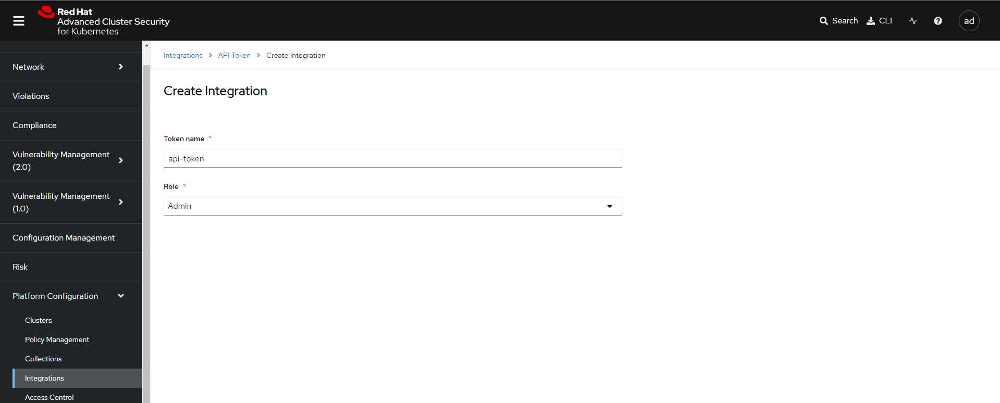

we should save it for use later or we cna set it on env var : export ROX_API_TOKEN="" , it will be used when login later with the cli 

Install the [roxctl cli](https://docs.openshift.com/acs/4.3/cli/installing-the-roxctl-cli.html) and use it to verify to check image for verify if the API Token works

to get central url we cna execute 

```
CENTRAL_URL=$(oc get route central -n stackrox --template='{{.spec.host}}')
```

```
roxctl --insecure-skip-tls-verify image check --endpoint $CENTRAL_URL --image registry.redhat.io/3scale-amp2/apicast-gateway-rhel8:3scale2.13.7 

Policy check results for image: registry.redhat.io/3scale-amp2/apicast-gateway-rhel8:3scale2.13.7
(TOTAL: 1, LOW: 1, MEDIUM: 0, HIGH: 0, CRITICAL: 0)

+--------------------------------+----------+--------------+--------------------------------+--------------------------------+--------------------------------+
|             POLICY             | SEVERITY | BREAKS BUILD |          DESCRIPTION           |           VIOLATION            |          REMEDIATION           |
+--------------------------------+----------+--------------+--------------------------------+--------------------------------+--------------------------------+
|   Red Hat Package Manager in   |   LOW    |      -       |   Alert on deployments with    |        - Image includes        | Run `rpm -e --nodeps $(rpm -qa |
|             Image              |          |              |     components of the Red      |    component 'dnf' (version    |  'rpm' 'dnf' 'libsolv'   |
|                                |          |              |   Hat/Fedora/CentOS package    |     4.7.0-16.el8_8.noarch)     |   'hawkey' 'yum*')` in the   |
|                                |          |              |       management system.       |                                |   image build for production   |
|                                |          |              |                                |        - Image includes        |          containers.           |
|                                |          |              |                                |    component 'rpm' (version    |                                |
|                                |          |              |                                |     4.14.3-26.el8.x86_64)      |                                |
|                                |          |              |                                |                                |                                |
|                                |          |              |                                |        - Image includes        |                                |
|                                |          |              |                                |    component 'yum' (version    |                                |
|                                |          |              |                                |     4.7.0-16.el8_8.noarch)     |                                |
+--------------------------------+----------+--------------+--------------------------------+--------------------------------+--------------------------------+
WARN:   A total of 1 policies have been violated

```


## Integrate ACS with QUAY 

For this integration we will need to create Robot Account in our Quay since we will need it to push our images 

### Creating our  account in quay 
Since we already have quay installed, we are going to recover the route to be able to proceed with the creation of our user and our robot account

```
oc get route quay-registry-quay -n quay-registry --template='https://{{.spec.host}}'
https://quay-registry-quay-quay-registry.apps.cluster-xxxxx.xxxxx.sandbox.opentlc.com
```

Open the url in yuo browser and create a new account 

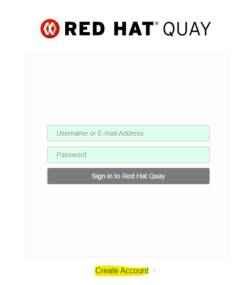 clickl in the button 

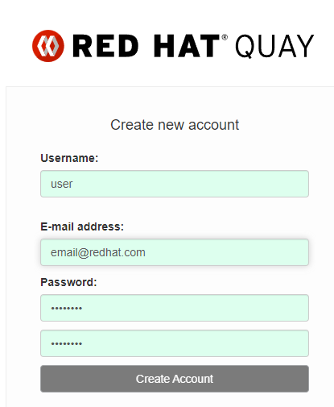

in this page complate with your data and Create 

### Creating registry in quay 
As mention before we require a repository to store the images generated by the pipeline. To accomplish this, we will to create an public repository on Quay, 
then we are going to create a robot account to accomplish this task

In Main Page go to Create New Repository
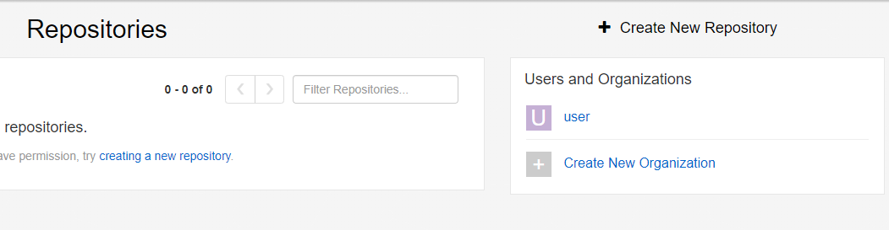

For the purpose of this demo, we are going to create a new one with the name **demo-secure-images** and we will mark the public option

after creation we need to create robbot account for this repo 

### Creating robot account  in quay and Permissions

To acomplish this wi will to Settings -> User and Robot Permissions -> Create robot account

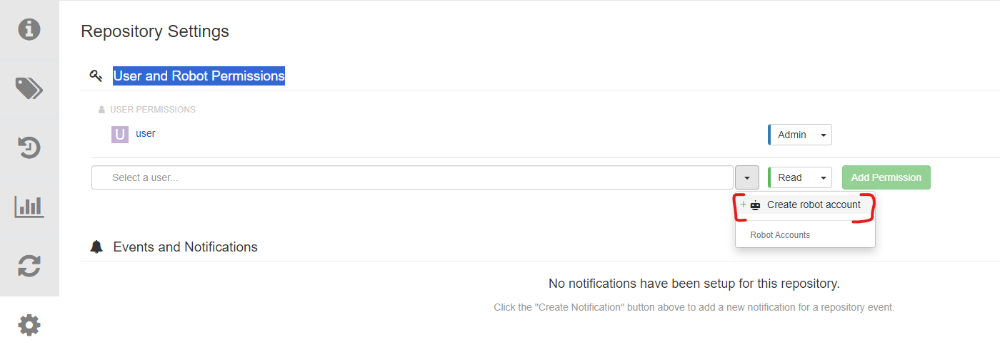

complatefields and Create
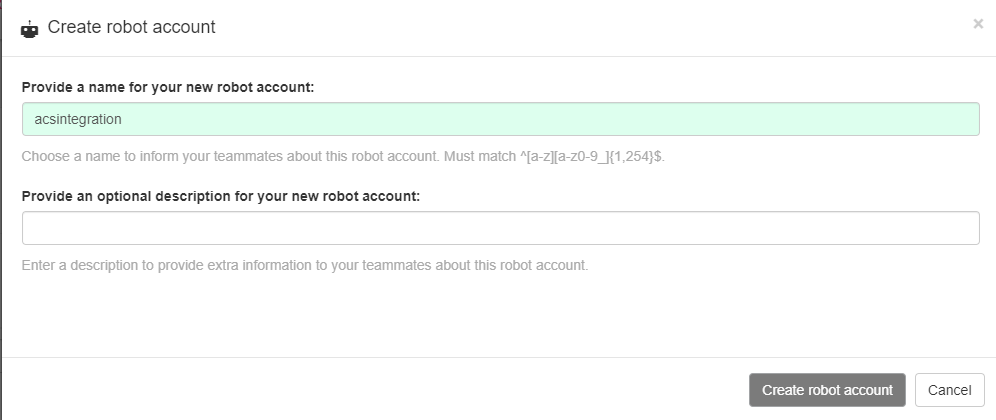

Add a Robot Account and assign at least write permission and Add Permission


Click on robot account name and save credentials for ACS
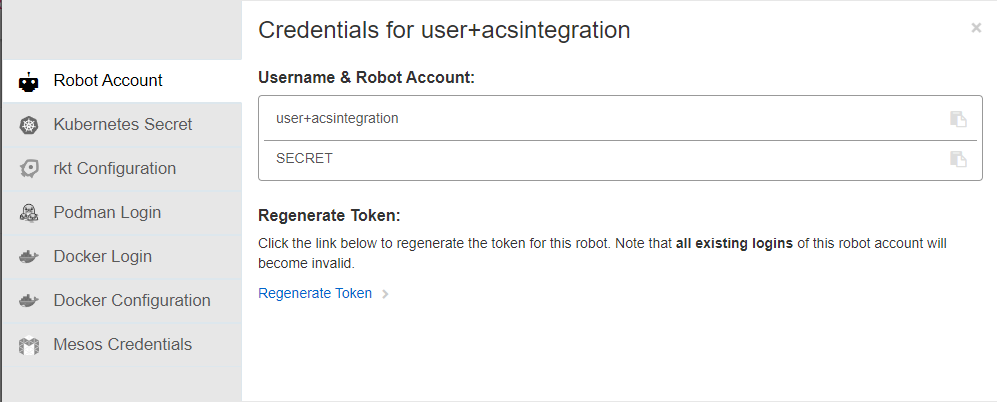

And  we can select Kubernetes Secret and Download the pull secret instead of manual generation

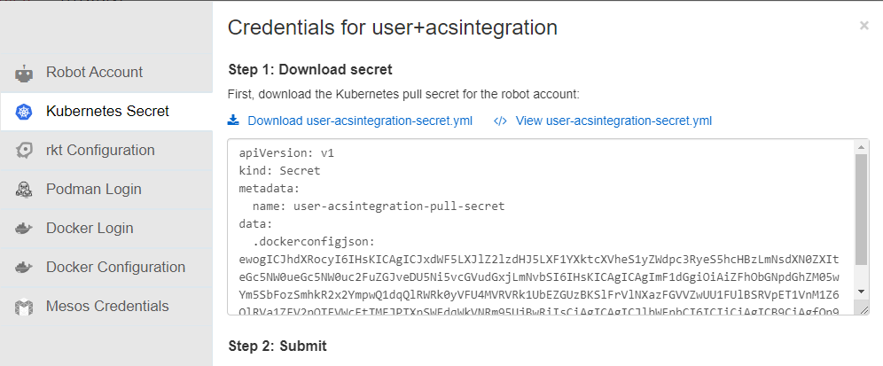

before proced with integration with acs we will to create and link the pull secret

to acomplish this we need to change the name of pull secred dowload in quay for **regcred** and namespace by **demo-secure-images**

```
apiVersion: v1
kind: Secret
metadata:
  name: **regcred**
  namespace: **demo-secure-images**
data:
  .dockerconfigjson: ...
```

and proced to apply 

```
oc apply -f /tmp/roxsecret.yaml
```

Since in Openshift GitOps the [service account link](https://github.com/Everything-is-Code/supply-chain-security/blob/main/resources/pipeline/10_service-account.yaml) is already configured, we do not have to do anything else

### Integration ACS with Quay

finally in ACS , go to Integrations -> Integrations -> Docker Registry -> New Integration

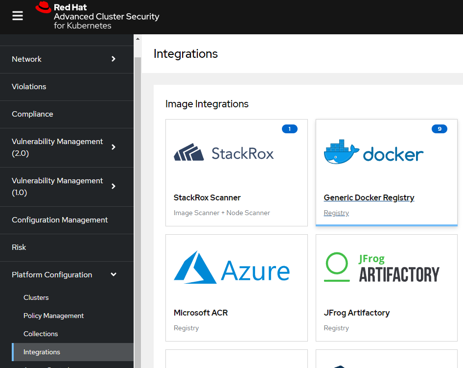

We proceed to complate fields: 
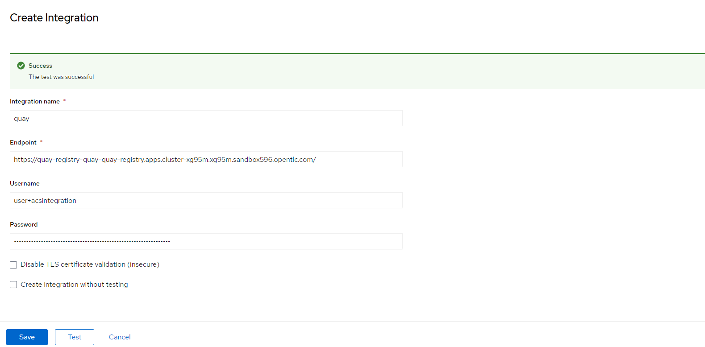 

Test and Save!!!

## Integrate ACS with the Openshift Pipeline

So far we have installed ACS and generated an Api Token, now we are going to integrate ACS with Openshift Pipelines
To do this we must generate a secret with the CENTRAL_URL and the ROX_API_TOKEN , **in adition we set a NAMESPACE var to facilitate secret creation** in this case we will use demo-secure-images 


```
cat > /tmp/roxsecret.yaml << EOF
apiVersion: v1
kind: Secret
metadata:
  name: roxsecrets
  namespace: $NAMESPACE
type: Opaque
stringData:
  rox_api_token: "$ROX_API_TOKEN"
  rox_central_endpoint: "$CENTRAL_URL:443"
EOF

oc apply -f /tmp/roxsecret.yaml
```


## Integrate ACS with cosign

At this moment we are [cosign 1.13.2](https://github.com/sigstore/cosign/releases/tag/v1.13.2) , be sure your pipeline use the same version 

### Generating keys for pipeline and ACS 
Now use the cosign command to generate the key-pair and the secrets  at the same time in our namespace project 

```
cosign generate-key-pair k8s://$NAMESPACE/cosign

Enter password for private key: 
Enter password for private key again: 
Successfully created secret cosign in namespace stackrox
Public key written to cosign.pub
```

### Generating ACS Integration 

Now create a integration with signature for verify it 
Go to Platform Configuration -> Integrations -> Signatures and Create New One 

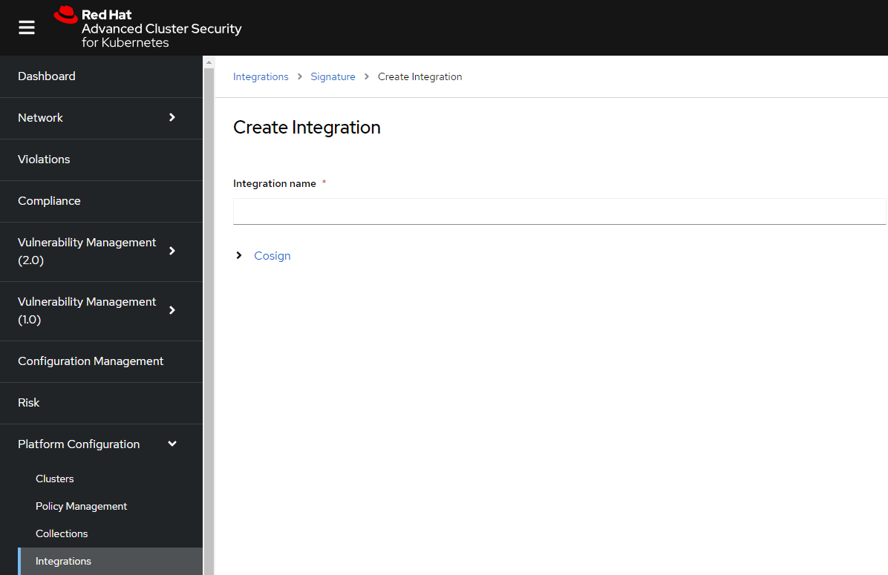

Complate the public key name , copy the secret data generated in the previous step , name of file por publick-key name and the key in the other field

## Generating ACS Policies for image signature verification

Now we proced to create two new policy in acs Go to Platform Configuration -> Policy Management -> Import Policiy

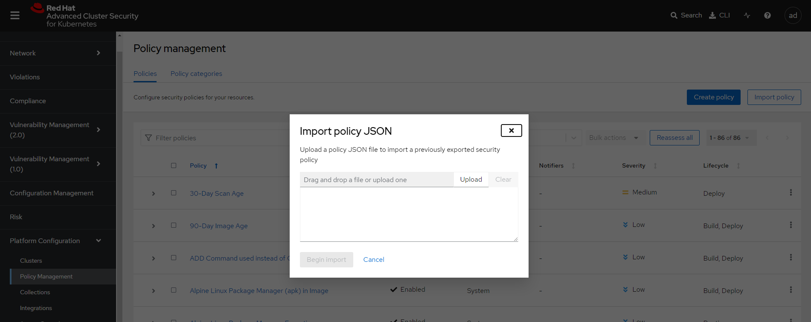 

select one of this 2  (for this demo we will use the first one all namespaces ) and copy the content

[Image_signature_verificator](assets/Image_signature_verificator.json) this is for all namespaces
[Image_signature_verificator](assets/Image_signature_verificator_ns) and this is namespace specific

**note: you can change Policy behavior to inform or Enforce as requiere for your case **

check the policie works!! 

```
roxctl --insecure-skip-tls-verify image check -e central-stackrox.apps.cluster-svv7j.svv7j.sandbox1747.opentlc.com --image registry.redhat.io/3scale-amp2/apicast-gateway-rhel8:3scale2.13.7 --token-file=token

Policy check results for image: registry.redhat.io/3scale-amp2/apicast-gateway-rhel8:3scale2.13.7
(TOTAL: 3, LOW: 1, MEDIUM: 0, HIGH: 1, CRITICAL: 1)

+--------------------------------+----------+--------------+--------------------------------+--------------------------------+--------------------------------+
|             POLICY             | SEVERITY | BREAKS BUILD |          DESCRIPTION           |           VIOLATION            |          REMEDIATION           |
+--------------------------------+----------+--------------+--------------------------------+--------------------------------+--------------------------------+
|  Image_signature_verificator   | CRITICAL |      X       |  Alert and Block Images when   |      - Image signature is      |     Images must be signed.     |
|                                |          |              |   they have not been signed.   |           unverified           |                                |
+--------------------------------+----------+--------------+--------------------------------+--------------------------------+--------------------------------+
| Trusted_Signature_Image_Policy |   HIGH   |      -       | Alert on Images that have not  |      - Image signature is      | All images should be signed by |
|                                |          |              |          been signed           |           unverified           |   our cosign-demo signature    |
+--------------------------------+----------+--------------+--------------------------------+--------------------------------+--------------------------------+
|   Red Hat Package Manager in   |   LOW    |      -       |   Alert on deployments with    |        - Image includes        | Run `rpm -e --nodeps $(rpm -qa |
|             Image              |          |              |     components of the Red      |    component 'dnf' (version    |  'rpm' 'dnf' 'libsolv'   |
|                                |          |              |   Hat/Fedora/CentOS package    |     4.7.0-16.el8_8.noarch)     |   'hawkey' 'yum*')` in the   |
|                                |          |              |       management system.       |                                |   image build for production   |
|                                |          |              |                                |        - Image includes        |          containers.           |
|                                |          |              |                                |    component 'rpm' (version    |                                |
|                                |          |              |                                |     4.14.3-26.el8.x86_64)      |                                |
|                                |          |              |                                |                                |                                |
|                                |          |              |                                |        - Image includes        |                                |
|                                |          |              |                                |    component 'yum' (version    |                                |
|                                |          |              |                                |     4.7.0-16.el8_8.noarch)     |                                |
+--------------------------------+----------+--------------+--------------------------------+--------------------------------+--------------------------------+
WARN:   A total of 3 policies have been violated
ERROR:  failed policies found: 1 policies violated that are failing the check
ERROR:  Policy "Image_signature_verificator" - Possible remediation: "Images must be signed."
ERROR:  checking image failed after 3 retries: failed policies found: 1 policies violated that are failing the check
```

## Time to Test Pipeline!!

#TODO WIP


